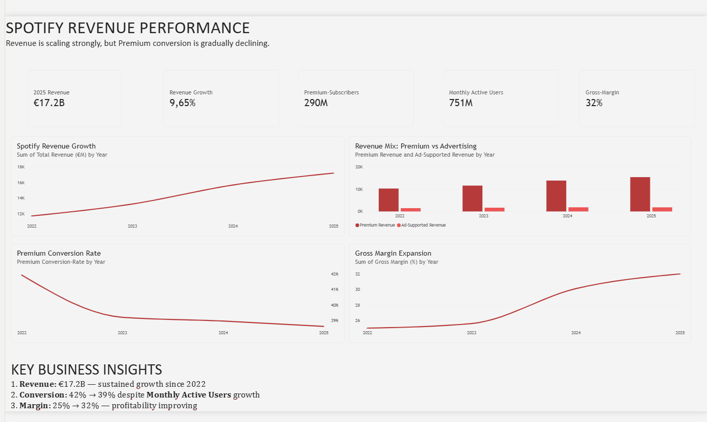

# Spotify Revenue & Monetization Analysis

Power BI dashboard analyzing Spotify's revenue growth and Premium monetization trends (2022–2025) — built to identify where user growth isn't converting into subscription revenue.

**TL;DR:** Revenue grew 47% (€11.7B → €17.2B) and margin improved 7pts (25% → 32%), but Premium conversion slipped from 42% to 39% even as Monthly Active Users hit 751M — meaning growth is increasingly free-tier, not Premium.

## Overview

This Power BI project analyzes Spotify's revenue performance, user growth, Premium conversion, advertising revenue, and profitability from 2022–2025.

The dashboard is designed to answer one key question:

**Is Spotify's growing user base translating into stronger revenue and Premium monetization?**

*Data note: This project uses a simulated dataset modeled on Spotify's publicly reported annual metrics (revenue, MAU, Premium subscribers, margin). It is built for analytical and portfolio purposes, not sourced from Spotify's internal financial systems.*

## Dashboard



The `.pbix` file is available in the repository — open it in Power BI Desktop to explore the live model, filters, and DAX measures.

## Approach

- Modeled a star schema in Power BI with a fact table for yearly financials linked to a Year dimension.
- Built time-intelligence measures for YoY Revenue Growth and YoY Margin change.
- Split Revenue Mix into Premium vs. Ad-Supported series.
- Built and formatted Premium Conversion Rate as a percentage.
- Designed the subtitle and Key Insights panel to communicate the "so what" immediately.

## Key Insights

- **Revenue:** Increased from €11.7B in 2022 to €17.2B in 2025.
- **Premium:** Remains the dominant revenue stream, at roughly 4× Ad-Supported revenue by 2025.
- **Conversion:** Declined from 42% to 39% despite Monthly Active Users climbing to 751M.
- **Margin:** Improved from 25% to 32%, indicating improving profitability.

## Business Recommendation

Focus on improving the **free-to-Premium funnel** rather than relying solely on user acquisition. Spotify could test targeted free-tier restrictions in selected markets to improve conversion while protecting the margin gains achieved through 2025.

## Tools & Skills

- Power BI
- DAX
- Data Modeling
- Data Visualization
- Business Analysis

## Key DAX Measures

```dax
Revenue Growth % = 
DIVIDE(
    [Total Revenue] - CALCULATE([Total Revenue], DATEADD('Date'[Date], -1, YEAR)),
    CALCULATE([Total Revenue], DATEADD('Date'[Date], -1, YEAR))
)

Premium Conversion Rate = 
DIVIDE([Premium Subscribers], [Monthly Active Users])

Gross Margin % = 
DIVIDE([Gross Profit], [Total Revenue])
```

## Repository Structure

```text
├── README.md
├── images/
│   └── spotify-dashboard.png
└── pbix/
    └── Spotify_Revenue_Monetization_Analysis.pbix
```

## Conclusion

The analysis shows **strong revenue growth and improving profitability**, while declining Premium conversion represents the key monetization opportunity.

## Author

**Sem (Semehar Hailu)**  
Business Intelligence Engineer & Data Scientist  
📍 Rome, Italy · [LinkedIn](https://www.linkedin.com/in/semehar-mebrahtu-hailu-1a3055193/) · [Email](mailto:semeharhailu@gmail.com)
